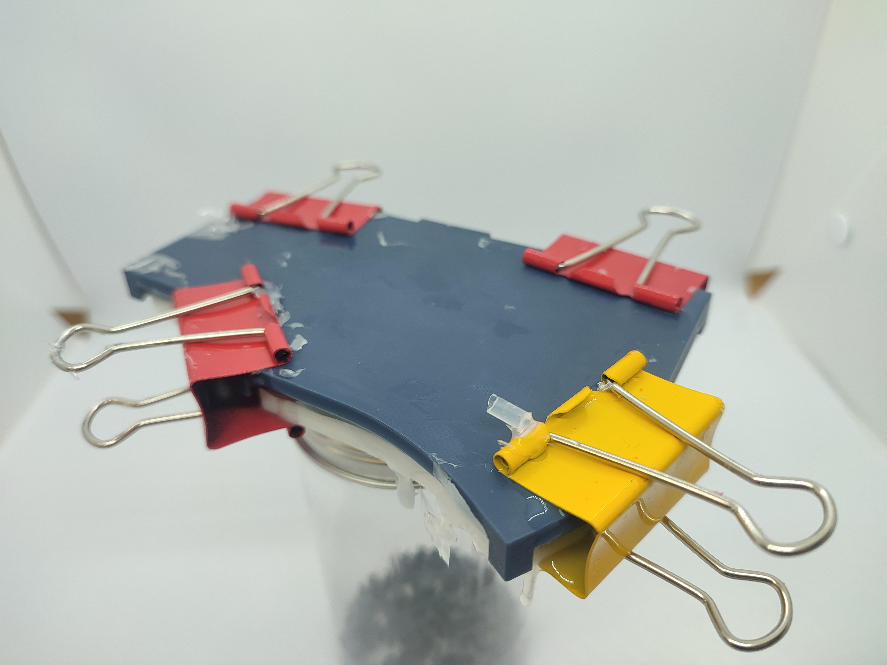

# THOREN: My humble keyboard
This is a small build log of my keyboard.

In early 2024 I've build my first split keyboard (slightly modified corne) and loved it.
I used boba u4 switches, end while they feel nice and barely make a sound, they felt somewhat heavy.
I wanted to try a smaller spaced low-profile keyboard, so I designed and ordered some PCBs. 
The layout is still very similar to corne, but the pinkie columns are slightly lower and I have an 
additional thumb key.

## Keyboard build
First step is soldering the hot swap sockets and diodes. 
After a first build I've found that the openings must be covered with e.g. electrical tape 
to prevent silicone from pouring in.

After that, the silicone carcass is glued. I've used CA glue, however now I think
epoxy glue would be a much better choice. The surface is pretty big and the CA glue evaporates
quickly.

To work with both V1 and V2 chocs I needed a button imitator.
First desgin was monolith, which proved to be a very bad desicion.
It tended to warp during printing and breaking a single pin would waste
the whole part. 

A composit design with replacable individual parts for each button worked much better.
You can see a half-broken stem that to be replaced on the picture.

Imitator is then installed and a first thin layer of silicone is poured.

Because the silicone carcass contains so many holes that trap air, and it will be 
covered to form a bottom surface, a vaccuum is needed to make a good pour before the cover is installed.
A first layer is needed to seal all of the through holes in the pcb, including
hot swap sockets. And if the holes in the sockets are not sealed 
during the vaccuumation, the experience shows that the silicone will get in :(
The first layer is not coverd, so any trapped air can be poked with a needle.

The cover design took multiple iterations and proved that the carcass design is
suboptimal. Since there are only a few positioning holes for teh carcass, and multiple thin features, 
the dimensions of the carcass were slightly different and the cover would not make a prefrect fit.
The channels on the sides of the cover were made to ensure that the silicone can find a way out, but
are probably not required if the silicone is fresh. The silicone MUST be fresh and runny. If it's not fresh,
it is much more viscous and does not level under gravity well, which may cause bumps and uneven bottom surface.

To prevent silicone from running when it bubbles under vacuum, a temporary wall is installed.

After the silicone finished bubbling the side walls are removed and a cover is placed on top,
forcing the excess silicone out. I used office clamps to apply pressure, however in my case they sometimes 
applied too much force, which in combination with not perfect carcass/cover fit caused the cover to bend and 
form and uneven surface. Fortunately the silicone could be removed, allowing to repour again.

Next, the cover and button immitator are removed.

Afterward, MCU sockets, buttons and battery are soldered. 
I find surface mounted sockets to be a great solution, they are easy to install, low-profile, and use
normal square pins, that can be easily bought and cut in length. My first split keyboard was built 
with thin round pins. I was unable to find where to buy fitting long pins without plastic spacer for a sane price.
The normal pins if cut flush under the plastic produce almost identical half-pins, reducing the work in half :)

Next the case and switches are installed.
The case is held in place entirely on the switches. I couldn't find a way to make a mounting solution that i liked,
but this proved to be good enough for me. The case is resing printed from an engineering resin.

When i bought switches, i did not realize that there are none commercial keycaps with 
compact spacing and mx stems (correct me if i'm wrong). I was going to use 3d printed ones anyways, but
a friend of mine was somewhat disappointed.  
To achieve the minimal thickess the keycaps also needed to be thin. The first iteration 
(now only used for 6th column) was super simple, 1mm thick keycaps, however it was almost impossible to
differentiate between keys. Later, when adding recess, i've entered 0.7mm depth cut, instead of 0.3mm. 
Surprisingly they printed, and the fingers felt perfect. This has bitten me later, when making thumb clusters.
Since the cut is longer, the super-thin 0.3mm part is also longer, and many, many keys were warped and craced after 
IPA cleaning ;(

I am really happy that the whole board turned out to be only 14mm thick.

Now, to finish the project i wanted to make a carrying case. A simple FDM printed case with felt inlining.

A ribbon to extract the boards is glued in with dichloromethane.

Then a felt inline is glued, again with dicholoromethane.

The second half has some 0.2mm thick covers to better hold the ribbon in place, 
since felt can be stretched easily (good thing i totally didn't make too many cases wihtout this feature)

I tried using dichloromethane to glue the halves together, however it evaporated to quickly and even small 
smudges would make the side surfaces ugly. So i switched to epoxy glue to combine the halves togetner.

Showcase video

